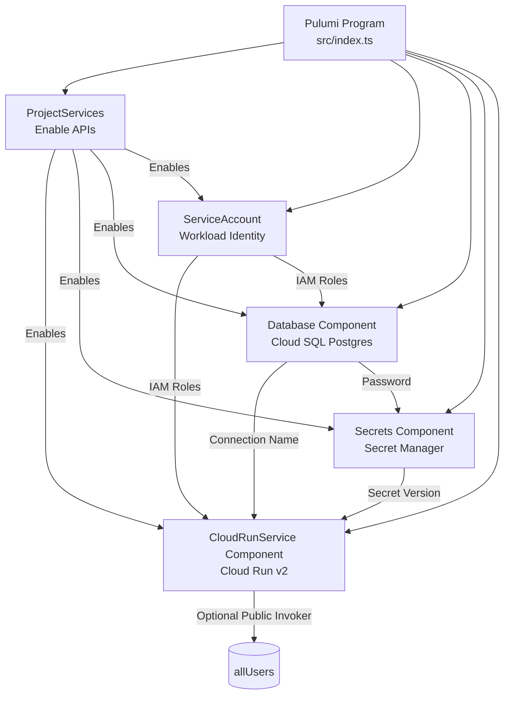

# Self-Hosting n8n on Google Cloud Run: Complete Guide

So you want to run n8n without the monthly subscription fees, keep your data under your own control, and avoid the headache of server maintenance? Google Cloud Run offers exactly that sweet spot: fully managed, serverless containers with per-use pricing. This repo gives you a production-ready, modular Pulumi program that stands up the official n8n container on Cloud Run, backed by Cloud SQL Postgres, wrapped with Google Secret Manager, and ready for secure automation at scale.

## Why Teams Self-Host n8n on Cloud Run

- **Predictable cost & scale** – Pay only for requests Cloud Run serves. Autoscaling keeps latency low without paying for idle VM time.
- **Data sovereignty** – Your workflows, credentials, and execution history stay inside your GCP footprint, satisfying security or compliance requirements.
- **Native Google integrations** – Built-in OAuth consent, low-latency access to GCP services, and the ability to use Workload Identity with the deployed service account.
- **Infrastructure as Code** – Pulumi keeps a full inventory of the deployed resources so you can version, review, and promote changes across environments.

## Costs

GCP Infrastructure costs are approximately ~$25 USD / month for a starter setup.
For a simple starter setup (config that's in the repo) these are the approximate costs.

Depends on your usage and how big of a DB you need - but it's super cheap and as you scale this will be 8x cheaper than using n8n managed instance.


## Component-Driven Pulumi Structure

- **ProjectServices** enables the core GCP APIs (Run, Secret Manager, Cloud SQL Admin, and Resource Manager) so every other resource has the prerequisites it needs.
- **ServiceAccount** provisions the dedicated workload identity for n8n and grants it IAM roles for Cloud SQL and Secret Manager access.
- **Database** creates the Cloud SQL Postgres instance, database, user, and randomly generated password.
- **Secrets** stores sensitive values—database password and n8n encryption key—in Secret Manager with latest-version references for runtime.
- **CloudRunService** deploys the n8n container to Cloud Run, mounts the Cloud SQL proxy, injects secrets, and optionally grants public invoker access.

## Architecture Overview



- **Cloud Run Service** (`gcp.cloudrunv2.Service`) hosts the official `docker.io/n8nio/n8n:latest` image with CPU boost, health probes, and Cloud SQL proxy volume mount.
- **Cloud SQL (Postgres 15)** stores workflow state, credentials, and execution logs.
- **Secret Manager** secures the database password and n8n encryption key generated via `@pulumi/random`.
- **Service Account** carries the minimum IAM roles (Cloud SQL Client, Secret Accessor) and is optionally granted the anonymous `roles/run.invoker` binding for public access.

## Prerequisites

- Google Cloud project with billing enabled.
- Organization policies that permit adding `allUsers` to Cloud Run (only if you enable public access).
- Local tooling: `gcloud`, `pulumi` CLI, Node.js 18+ (for Pulumi Node runtime), and `pnpm` or `npm`.
- Correct Google credentials in your shell (`gcloud auth application-default login` or `GOOGLE_APPLICATION_CREDENTIALS`).

## Repository Layout

```
.
├─ README.md
├─ LICENSE
├─ package.json
├─ package-lock.json            # Generated when using npm
├─ pnpm-lock.yaml               # Generated when using pnpm
├─ Pulumi.yaml
├─ Pulumi.self-host-n8n-gcp.yaml
├─ tsconfig.json
└─ src/
   ├─ config.ts                # Aggregates Pulumi stack config into DeploymentConfig
   ├─ index.ts                 # Entry point orchestrating component creation
   ├─ components/
   │  ├─ __tests__/            # Jest unit tests exercising component factories
   │  │  ├─ cloudRunService.test.ts
   │  │  ├─ database.test.ts
   │  │  ├─ secrets.test.ts
   │  │  └─ serviceAccount.test.ts
   │  ├─ cloudRunService.ts    # Cloud Run deployment + IAM binding
   │  ├─ database.ts           # Cloud SQL instance, database, user, password
   │  ├─ projectServices.ts    # Enables required GCP APIs
   │  ├─ Secrets.ts            # Secret Manager secrets for password and encryption key
   │  ├─ ServiceAccount.ts     # Workload identity + role attachments
   │  └─ index.ts              # Barrel file exporting component factories
   ├─ types/
   │  ├─ config.types.ts       # Deployment configuration interfaces
   │  └─ components.types.ts   # Component return types
   └─ utils/
```

Generated directories such as `node_modules/` are omitted for brevity.

````

## Running Tests

- `pnpm test`

The Jest suite uses Pulumi runtime mocks to validate each component in isolation. Because the mocks short-circuit calls to GCP, the tests execute quickly, cost nothing, and run safely in CI or on developer machines without needing cloud credentials. They assert on the exact resource inputs Pulumi will send to Google—catching mistakes in IAM bindings, secret wiring, or service configuration long before you reach `pulumi preview` or `pulumi up`. Keeping the specs alongside the components in `src/components/__tests__` mirrors the implementation layout, making it easy to add coverage as you evolve the infrastructure.

## Pulumi Deployment Steps

1. **Install dependencies**

   ```bash
   pnpm install       # or npm install
````

2. **Log in to Pulumi backend** (Pulumi Cloud or local)

   ```bash
   pulumi login
   ```

3. **Select or create a stack**

   ```bash
   pulumi stack init dev   # or pulumi stack select <project>/<stack>
   ```

4. **Configure GCP project and optional overrides**

   ```bash
   pulumi config set gcp:project <your-project-id>
   pulumi config set gcp:region us-west2               # override default region if desired
   pulumi config set n8n-self-host-on-gcp:dbUser n8n   # optional per-stack values
   pulumi config set n8n-self-host-on-gcp:allowUnauthenticated true   # only if org policy allows public access
   ```

   Available Pulumi config keys (namespace `n8n-self-host-on-gcp`):

   | Key                     | Type    | Default               | Purpose                                           |
   | ----------------------- | ------- | --------------------- | ------------------------------------------------- |
   | `dbName`                | string  | `n8n`                 | Cloud SQL database name                           |
   | `dbUser`                | string  | `n8n-user`            | Database username                                 |
   | `dbTier`                | string  | `db-f1-micro`         | Cloud SQL machine tier                            |
   | `dbStorageSize`         | number  | `10`                  | Storage in GB                                     |
   | `cloudRunServiceName`   | string  | `n8n`                 | Cloud Run service name                            |
   | `serviceAccountName`    | string  | `n8n-service-account` | Workload identity                                 |
   | `cloudRunCpu`           | string  | `1`                   | CPU limit per container                           |
   | `cloudRunMemory`        | string  | `2Gi`                 | Memory limit per container                        |
   | `cloudRunMaxInstances`  | number  | `1`                   | Cloud Run autoscaling cap                         |
   | `cloudRunContainerPort` | number  | `5678`                | n8n container port                                |
   | `genericTimezone`       | string  | `UTC`                 | Default timezone for n8n                          |
   | `allowUnauthenticated`  | boolean | `true`                | If true, grants `roles/run.invoker` to `allUsers` |

5. **Preview and apply**

   ```bash
   pulumi preview   # review changes
   pulumi up        # deploy resources
   ```

   On success Pulumi outputs:
   - Cloud Run URL (`cloudRunServiceUrl`)
   - Cloud SQL connection name (`cloudSqlConnectionName`)
   - Service account email (`n8nServiceAccountEmail`)

6. **Access n8n**
   - If `allowUnauthenticated` is `true`, open the Cloud Run URL directly.
   - Otherwise grant specific identities `roles/run.invoker`:
     ```bash
     gcloud run services add-iam-policy-binding n8n \
      --region <region> \
      --project <project-id> \
      --member user:<you@example.com> \
      --role roles/run.invoker
     ```

## Operations & Maintenance

- **Updates**: Modify configuration or code, run `pulumi up` to apply diffs. Pulumi handles dependency ordering and state management.
- **Teardown**: `pulumi destroy` removes all resources—including the Cloud SQL instance—when you no longer need the stack.
- **Secrets rotation**: Re-run `pulumi up` to regenerate the database password or encryption key. Secret Manager stores new versions automatically, and the Cloud Run revision restarts with fresh credentials.
- **Monitoring**: Use the Cloud Run Logs Viewer (link surfaced in deploy logs) and Cloud SQL monitoring dashboards for runtime health checks.

## Troubleshooting Tips

- **Permission errors when enabling public access**: Ensure no parent organization policy (`iam.allowedPolicyMemberDomains`, `run.managed.requireInvokerIam`) blocks `allUsers`. Allow enough time for policy propagation before reapplying.
- **Container fails to start**: Check Cloud Run logs for startup errors (commonly caused by overriding the container command or misconfigured secrets).
- **Pulumi config missing**: Remember both `gcp:project` and `gcp:region` must be set (or provided via environment variables) before running `pulumi up`.

## Next Steps

- Integrate n8n with Google Workspace by granting the service account scoped OAuth credentials.
- Add Cloud Logging sinks or Cloud Monitoring alerts to detect workflow failures.
- Use Pulumi deployments or CI pipelines to promote changes across dev, staging, and prod stacks.

Enjoy automation freedom with n8n on Google Cloud Run—fully controlled, cost-efficient, and managed as code.
